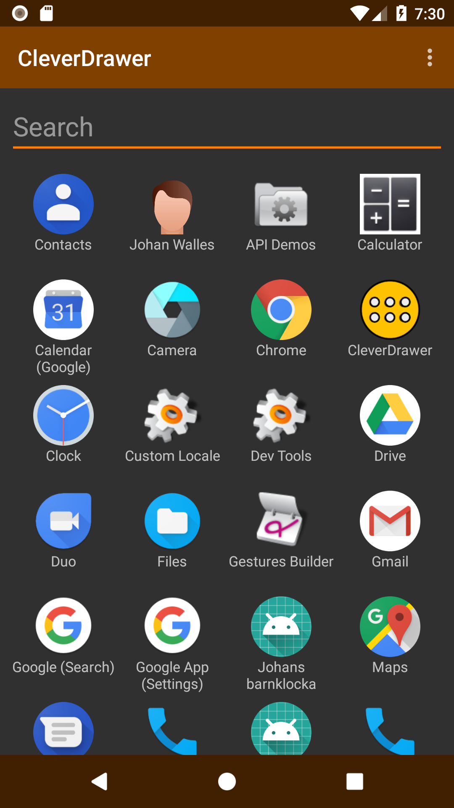

# CleverDrawer

App, settings and contacts drawer that reads your mind.

It then uses that information to sort apps, settings and contacts with
the things you are most likely to launch first.

# Hacking
* `git clone git@github.com:walles/cleverdrawer.git`
* [Download and install Android Studio](https://developer.android.com/sdk/index.html)
* Start Android Studio
* "Open an existing Android Studio project" and point it to where you cloned the source code
* Add an `app/fabric.properties` file with one line: "`apiKey=0`" (or follow the [official Crashlytics
instructions](https://docs.fabric.io/android/fabric/settings/working-in-teams.html#android-projects))
* Next to the green play button in the top toolbar, make sure the dropdown says "CleverDrawer"
* Click the green play button to build / launch, install any requested components
* Do `./gradlew check` to test and lint code before making a pull request. This is
[what Travis does](https://github.com/walles/exactype/blob/master/.travis.yml) anyway, so this is
also a good way of researching Travis problems locally.

## Releasing
1. Do `git tag | cat` and think about what the next version number should be.
2. Do `git tag 1.2.3` to set the next version number.
3. `env JAVA_OPTS=-Xmx512m ./gradlew --no-daemon build`
4. Upload `app/build/outputs/apk/app-release.apk` to Google Play
5. `git push --tags`

# TODO Before First Public Release
* Add an About entry in the ... menu
* Back button should cancel ongoing search
* Rework icon and feature image. Still consider the brand color.

# TODO Misc
* Sort recently installed apps earlier
* Don't Crashlytics report during instrumentation tests
* Enable finding contacts by nickname
* Enable finding contacts by organization
* Enable finding contacts by title
* Enable finding contacts by e-mail
* Move names caching into `IntentLaunchable`
* Speed up reading names from cache; it takes 256ms of the 600ms startup time
* Fix icon loading so that rapid scrolling after start screen loaded
doesn't look weird
* Crashlytics log whether people have searched or scrolled when
launching a Launchable?
* Fix `@Nullable` related warnings
* Disable launching CleverDrawer itself?
* Get a real-world launch history and test the prediction algorithm
using that
* Swipe down for search
* Make Travis run the instrumented tests
* Run [Findbugs](https://docs.gradle.org/current/userguide/findbugs_plugin.html) in Travis
* Run [ErrorProne](https://github.com/google/error-prone/blob/master/examples/gradle/build.gradle) in Travis
* Make a pre-commit hook that runs `gradlew check --continue`
* Use weekday vs weekend as scoring factor
* Use time of day as a scoring factor
* Use most recently used other app as scoring factor
* Long clicking app should bring up a menu:
  * Add shortcut to home screen
  * Show on Google Play
  * Show app info
  * Uninstall

# DONE
* Add Timber logging
* List installed apps
* List launchable activities in `MainActivityFragment.java`
* Show a grid. It can be empty or have some contents.
* Put some contents in the grid. Anything goes.
* Sort app list alphabetically by title
* List installed app names in the grid
* Add an icon above each app name
* Make the grid scrollable
* Launch app when clicked
* Remove app from running apps after launching
* Adjust number of columns
* Size all icons the same
* Center app titles
* Make sure rows are aligned on initial load
* Keep per-app stats on:
  * Number of launches
  * Time of first launch
  * Time of last launch
* Sort list based on saved per-app stats
* Reload statistics each time the user re-activates us
* Log startup time
* Add a `cache` database table, mapping IDs to app labels
* After loading the launchables, update the cache with all new IDs
* After loading the launchables, remove not-found launchable IDs from
the cache
* After loading the launchables, fill in all names we have from the
cache
* In the background, after we're done with the cache, load all actual
app labels from the system and update all cache lines that have changed
* Fix startup time
* Four icons per row on my phone
* Use a dark background
* Run [Android Lint](http://tools.android.com/tips/lint-checks) in Travis
* Run unit tests in [Travis](https://travis-ci.org/)
* Add a search button that filters the app list as you type
* Set search box IME Action flag
* Test grid with different font sizes and app name lengths
* Verify there are no duplicate IDs in the launchables list
* Move scoring logic into Launchable.java
* Don't show Launchables with empty labels
* Give settings a lower score than apps
* Make sure the System Battery Settings is in the list on my Galaxy S6
* Add [Crashlytics crash reporting](https://fabric.io/kits/android/crashlytics/install)
* Don't log to Crashlytics while running Instrumented Tests
* Don't log to Crashlytics while running in the emulator
* Don't log to Crashlytics while unit testing
* Point Timber logs to Crashlytics
* Log non-fatal exceptions to Crashlytics
* Don't crash if user rotates the device (may or may not be done, let's
see if we get crash reports)
* Create a release process with automated release numbering
* Decide on a brand color: It's the `colorPrimary` in
[`colors.xml`](app/src/main/res/values/colors.xml).
* Create a 1024x500 JPEG feature image, consider the brand color
* Create a 512x512 transparent PNG icon, consider the brand color
* Make sure our app uses the icon
* Create a second screenshot
* Add a `LICENSE` file
* Release a beta on Google Play
* How can I test the prediction algorithm?
* Update UI to match the brand color
* Report duplicate labels to Crashlytics
* Report launch counts to Crashlytics, use that as our KPI
* Get somebody to install + start using the beta
* Add contacts as launchables
* Crashlytics log answers to "READ_CONTACTS please?" question
* Verify there are no duplicate labels in the launchables list
* Add system settings to the list.
* Add a Contact Developer entry in the ... menu
* Remove Settings entry in the ... menu
* Include launch history JSON in the Contact Developer e-mails
